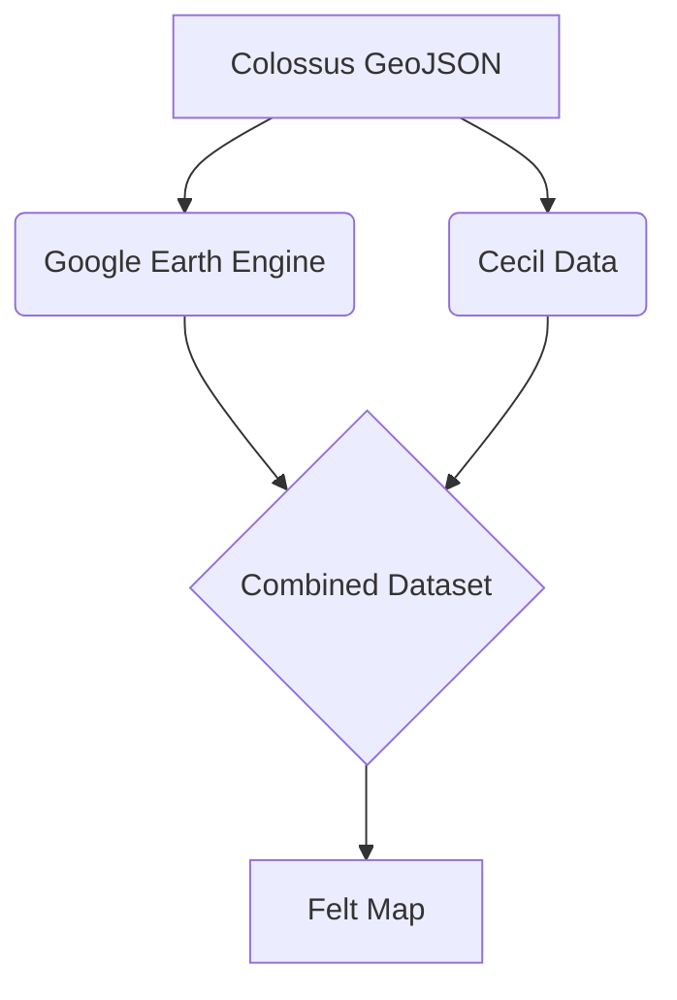

# CS 598: Final Project

This repository contains all the code and technical artifacts for my course project for _CS 598: Foundations of Data Curation_

--- 

# Project Setup Instructions 

## Google Cloud Authentication

### Google Earth Engine Authentication

## Cecil Earth API Instructions

To get a Cecil API Key, follow the instructions provided on 

## Felt Setup Instructions

To replicate the workflow for uploading the dataset to __Felt__, you will need to sign up for an account with the platform.

Once you recieve an _access token_, be sure to copy it to the `.env` file.

## .env File

For this project, I used `python-dotenv` to load environment variables from a `.env` file. I have provided a skeleton of all the neccessary environment variables in `.env.example`. 

In particular, you will need to provide the name of the `Google Cloud Project` that has Earth Engine enabled.

--- 
# Project Overview 

The general workflow is described in the below diagram. A _GeoJSON_ polygon describing a bounding box around the __X.ai Colossus Data Center__ in Memphis, Tennessee is created using (Website goes here). 

The `GeoJSON` polygon is then used to create an __Area of Interest (AOI)__ that can be used as input to __Google Earth Engine__ and __Cecil Earth__.

---

## Datasets Used

### Google Earth Engine

### Cecil Earth Datasets

Since _Cecil_ caches dataset requests by a `Subscription ID` and `User Credentials`, the Cecil dataset requests are created in `cecil_datasets.py`, and the `Subscription` metadata for each dataset request is stored  in `data/processed/cecil.json`. 