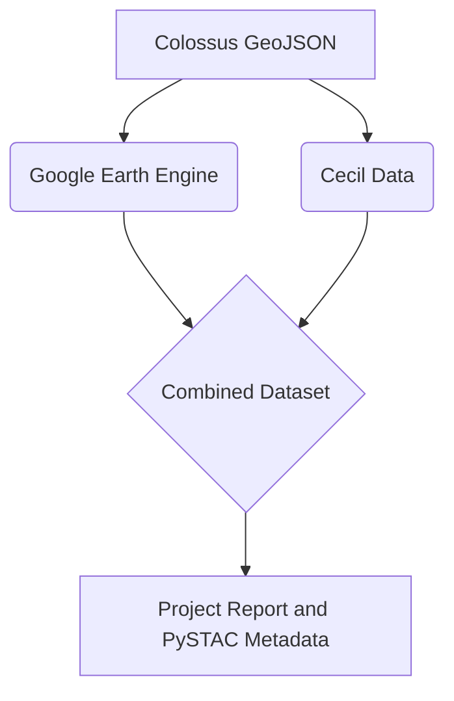

# CS 598: Final Project

This repository contains all the code and technical artifacts for my course project for _CS 598: Foundations of Data Curation_

--- 

# Project Setup Instructions 

## Google Cloud Authentication

To authenticate with Google Cloud, you will need to create a service account with the `Google Cloud Project` that has Earth Engine enabled. Follow the instructions provided by [Google Earth Engine](https://developers.google.com/earth-engine/guides/access) to either create a new GCP project or use an existing one with GEE.

Once the GCP project is created, add the name of project to the `.env` file.

## Cecil Earth API Instructions

To get a Cecil API Key, follow the instructions provided on Cecil's [Getting Started documentation](https://docs.cecil.earth/Getting-started-111ef16bbbe48123aaa1d0a4bbd0a63d)

Once you recieve an _API Key_, be sure to copy it to the `.env` file.

## Felt Setup Instructions

To replicate the workflow for uploading the dataset to [__Felt__](https://felt.com/), you will need to sign up for an account with the platform.

Once you recieve an _access token_, be sure to copy it to the `.env` file.

## .env File

For this project, I used `python-dotenv` to load environment variables from a `.env` file. I have provided a skeleton of all the neccessary environment variables in `.env.example`. 

In particular, you will need to provide the name of the `Google Cloud Project` that has Earth Engine enabled.

--- 
# Project Overview 

The general workflow is described in the below diagram. A _GeoJSON_ polygon describing a bounding box around the __X.ai Colossus Data Center__ in Memphis, Tennessee is created using [GeoJSON.io](https://geojson.io/). 

The `GeoJSON` polygon is then used to create an __Area of Interest (AOI)__ that can be used as input to __Google Earth Engine__ and __Cecil Earth__.

## General Workflow Order

To get started with this project, a new user should first execute `cecil_datasets.py` to set up the necessary Cecil Earth resources and register the Area of Interest. Following this, `earth_engine_test.py` should be run to authenticate with Google Earth Engine, explore initial data, and validate the AOI and cloud conditions. Finally, `combined_analysis.py` can be executed to perform the core temporal geospatial analysis, combining data from both platforms and generating the final report and metadata.

---

## Datasets and other Artifacts

### Colossus GeoJSON

The address for the X.ai Colossus Data Center is _5420 Tulane Rd, Memphis, TN 38109_. The `GeoJSON` polygon is created using [GeoJSON.io](https://geojson.io/). I entered the address into the search bar, and then drew a polygon around the area. I redrew the polygon multiple times until getting a polygon that covered the entire data center and surrouding buildings.

The `GeoJSON` polygon is stored in `data/colossus.geojson`.

### Google Earth Engine

### Cecil Earth Datasets

Since _Cecil_ caches dataset requests by a `Subscription ID` and `User Credentials`, the Cecil dataset requests are created in `cecil_datasets.py`, and the `Subscription` metadata for each dataset request is stored  in `data/processed/cecil.json`.

---

# Codebase Reference

## Notebooks (`src/notebooks`)

### `earth_engine_test.py`
An interactive Marimo notebook designed for initial data exploration. It handles authentication with Google Earth Engine, loads the defined Area of Interest (AOI), and visualizes Sentinel-2 imagery. It serves as a testbed for validating the AOI and checking cloud cover conditions before running the full analysis.

### `combined_analysis.py`
The core analysis pipeline for the project. This Marimo notebook performs the temporal geospatial analysis by:
1.  fetching Sentinel-2 NDVI data from Google Earth Engine;
2.  retrieving "Land Cover 9-Class" data from Cecil Earth;
3.  geospatially joining these datasets;
4.  calculating vegetation statistics and changes between 2022-2023 and 2024-2025;
5.  generating a Markdown report and PySTAC metadata items.

## Utilities (`src/utils`)

### `cecil_datasets.py`
A Python script for setting up the Cecil Earth environment. It reads the local GeoJSON AOI, registers it as an AOI in Cecil, and creates the necessary data `Subscriptions` (e.g., for Land Cover data). This script must be run once to initialize the resources on the Cecil platform.

### `render_map.py`
A utility script that generates an interactive HTML map using OpenLayers. It reads the project's `colossus.json` GeoJSON file and produces a standalone HTML file (`outputs/maps/colossus_map.html`). This allows for local, offline visualization of the site boundary and geometry verification.