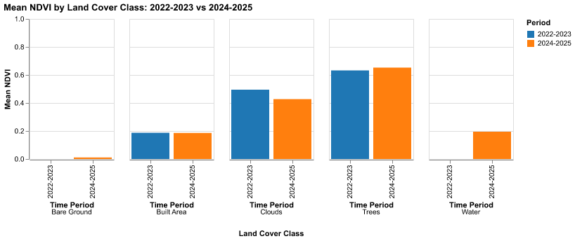

# Temporal Geospatial Analysis Report

**Date:** 2025-12-10 22:12:51
**AOI:** data/colossus.json

## Executive Summary
Comprehensive analysis of vegetation health (NDVI) across land cover classes between **2022-2023** and **2024-2025** for the Colossus supercomputer site. Analysis combines Sentinel-2 multispectral imagery with Cecil's 9-class land cover dataset.

## Study Area
**Location**: Colossus Supercomputer Site
**Total Pixels**: 12,840 (Period 1), 12,840 (Period 2)
**Coverage Area**: ~1.28 km²

## Methodology

### Data Sources
- **Vegetation Index**: Sentinel-2 Surface Reflectance (COPERNICUS/S2_SR_HARMONIZED)
  - NDVI calculated from B8 (NIR) and B4 (Red) bands
  - Cloud threshold: <5%
  - Spatial resolution: 10m

- **Land Cover Classification**: Cecil Land Cover 9-Class
  - Dataset ID: 89d81a76-3c42-4365-92c2-c1b8a00aacd5
  - Classes: Water, Trees, Grass, Flooded Vegetation, Crops, Scrub/Shrub, Built Area, Bare Ground, Snow/Ice
  - [Documentation](https://docs.cecil.earth/Land-Cover-9-Class-111ef16bbbe481c0bb41e6e79ec441c8)

### Processing Steps
1. Temporal compositing using median values to reduce cloud interference
2. NDVI calculation: (NIR - Red) / (NIR + Red)
3. CRS reprojection from EPSG:3857 (Cecil) to EPSG:4326 (Earth Engine)
4. Statistical aggregation by land cover class

## Results

### 2022-2023
|   land_cover |   mean_ndvi |   std_ndvi |   pixel_count |
|-------------:|------------:|-----------:|--------------:|
|            2 |    0.632123 |  0.0820451 |          8547 |
|            7 |    0.187794 |  0.194116  |          4057 |
|           11 |    0.49529  |  0.0779416 |           236 |

### 2024-2025
|   land_cover |   mean_ndvi |     std_ndvi |   pixel_count |
|-------------:|------------:|-------------:|--------------:|
|            1 |   0.194533  | nan          |             1 |
|            2 |   0.652881  |   0.0992251  |          4055 |
|            7 |   0.186417  |   0.186723   |          7924 |
|            8 |   0.0112674 |   0.00306398 |            18 |
|           11 |   0.427168  |   0.0922613  |           842 |

### Change Analysis
|   land_cover | land_cover_name   |   mean_ndvi |   mean_ndvi_24 |   ndvi_change |   ndvi_pct_change |   pixel_count |   pixel_count_24 |   area_change |   area_pct_change |
|-------------:|:------------------|------------:|---------------:|--------------:|------------------:|--------------:|-----------------:|--------------:|------------------:|
|            2 | Trees             |    0.632123 |       0.652881 |    0.0207579  |          3.28383  |          8547 |             4055 |    4294962804 |       5.02511e+07 |
|            7 | Built Area        |    0.187794 |       0.186417 |   -0.00137635 |         -0.732903 |          4057 |             7924 |          3867 |      95.3167      |
|           11 | Clouds            |    0.49529  |       0.427168 |   -0.0681216  |        -13.7539   |           236 |              842 |           606 |     256.78        |

